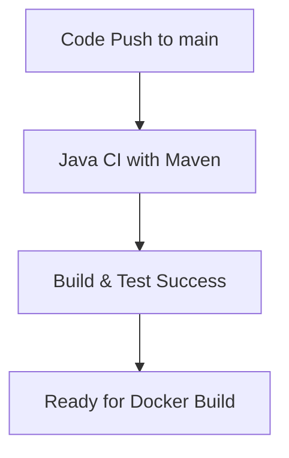
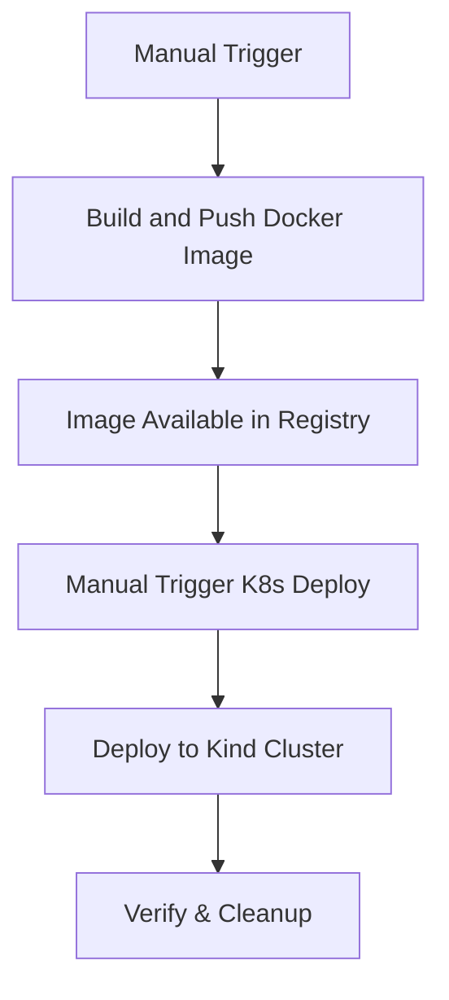

# GitHub Workflows Documentation

This document provides a comprehensive overview of the GitHub Actions workflows implemented in this Spring Boot JPA MySQL project. The project includes three distinct workflows that handle continuous integration, Docker image management, and Kubernetes deployment.

## 📋 Table of Contents

- [Overview](#overview)
- [Workflow 1: Java CI with Maven](#workflow-1-java-ci-with-maven)
- [Workflow 2: Build and Push Docker Image](#workflow-2-build-and-push-docker-image)
- [Workflow 3: Deploy to Kind Kubernetes](#workflow-3-deploy-to-kind-kubernetes)
- [Workflow Dependencies](#workflow-dependencies)
- [Required Secrets](#required-secrets)
- [Workflow Execution Flow](#workflow-execution-flow)
- [Best Practices](#best-practices)
- [Troubleshooting](#troubleshooting)

## 🎯 Overview

The project implements a complete CI/CD pipeline using GitHub Actions with three main workflows:

1. **Continuous Integration**: Automated testing and building on code changes
2. **Docker Image Management**: Building and pushing Docker images to registry
3. **Kubernetes Deployment**: Deploying the application to a Kind Kubernetes cluster

## 🔧 Workflow 1: Java CI with Maven

**File**: `.github/workflows/maven.yml`

### Purpose
Provides continuous integration by automatically building and testing the Spring Boot application whenever code is pushed or pull requests are created.

### Triggers
- **Push**: Triggers on pushes to the `main` branch
- **Pull Request**: Triggers on pull requests targeting the `main` branch

### Job Details
- **Runner**: `ubuntu-latest`
- **Java Version**: JDK 17 (Temurin distribution)
- **Build Tool**: Maven with dependency caching

### Steps
1. **Checkout Repository**: Uses `actions/checkout@v3` to access the code
2. **Setup JDK**: Configures Java 17 with Maven dependency caching
3. **Build with Maven**: Executes `mvn -B package --file pom.xml`

### Key Features
- ✅ Automatic dependency caching for faster builds
- ✅ Batch mode execution (`-B` flag) for non-interactive builds
- ✅ Triggered on both push and pull request events

```yaml
name: Java CI with Maven
on:
  push:
    branches: [ "main" ]
  pull_request:
    branches: [ "main" ]
```

## 🐳 Workflow 2: Build and Push Docker Image

**File**: `.github/workflows/buildAndPushAppImageToDockerRegistry.yaml`

### Purpose
Builds the Spring Boot application into a Docker image and pushes it to Docker Hub registry for deployment purposes.

### Triggers
- **Manual Trigger**: `workflow_dispatch` allows manual execution from GitHub UI

### Job Details
- **Runner**: `ubuntu-latest`
- **Java Version**: JDK 17 (Temurin distribution)
- **Registry**: Docker Hub
- **Image Name**: `piyush497/springbootjpa-mysql:latest`

### Steps
1. **Checkout Repository**: Uses `actions/checkout@v4`
2. **Setup JDK 17**: Configures Java environment with Maven caching
3. **Build Application**: Executes `mvn clean package -DskipTests`
4. **Debug Listing**: Lists files to verify build artifacts
5. **Docker Hub Login**: Authenticates using secrets
6. **Setup Docker Buildx**: Enables advanced Docker build features
7. **Build and Push**: Creates and pushes Docker image with caching

### Key Features
- ✅ Manual trigger capability for controlled deployments
- ✅ Skips tests for faster builds (`-DskipTests`)
- ✅ GitHub Actions cache integration for faster subsequent builds
- ✅ Debug steps for troubleshooting build issues
- ✅ Multi-platform build support via Docker Buildx

```yaml
name: Build and Push Docker Image
on:
  workflow_dispatch: # Manual trigger
```

### Docker Image Tags
- `piyush497/springbootjpa-mysql:latest`

## ☸️ Workflow 3: Deploy to Kind Kubernetes

**File**: `.github/workflows/pullApplicationImageAndRunInKubernetes.yaml`

### Purpose
Deploys the Spring Boot application to a Kind (Kubernetes in Docker) cluster for testing and demonstration purposes.

### Triggers
- **Manual Trigger**: `workflow_dispatch` for controlled deployment

### Job Details
- **Runner**: `ubuntu-latest`
- **Kubernetes**: Kind cluster with Kubernetes v1.28.0
- **Deployment**: Single replica deployment
- **Service**: NodePort service on port 80 → 8086

### Steps
1. **Checkout Code**: Repository access
2. **Setup Docker Buildx**: Docker build capabilities
3. **Docker Hub Login**: Registry authentication
4. **Setup Kind Cluster**: Creates local Kubernetes cluster
5. **Create K8s Manifests**: Generates deployment and service YAML
6. **Deploy to Cluster**: Applies Kubernetes manifests
7. **Verify Deployment**: Checks deployment status
8. **Cleanup**: Removes deployed resources

### Kubernetes Resources Created

#### Deployment
```yaml
apiVersion: apps/v1
kind: Deployment
metadata:
  name: springbootjpa-app-deployment
spec:
  replicas: 1
  selector:
    matchLabels:
      app: java-app
  template:
    spec:
      containers:
      - name: java-app
        image: piyush497/springbootjpa-mysql:latest
        ports:
        - containerPort: 8086
```

#### Service
```yaml
apiVersion: v1
kind: Service
metadata:
  name: springbootjpa-app-service
spec:
  selector:
    app: java-app
  ports:
    - protocol: TCP
      port: 80
      targetPort: 8086
  type: NodePort
```

### Key Features
- ✅ Ephemeral Kind cluster for testing
- ✅ Automatic manifest generation
- ✅ Deployment verification steps
- ✅ Resource cleanup after testing
- ✅ Uses pre-built Docker image from registry

## 🔗 Workflow Dependencies

### Execution Order
1. **Java CI with Maven** → Validates code quality
2. **Build and Push Docker Image** → Creates deployable artifact
3. **Deploy to Kind Kubernetes** → Tests deployment

### Dependency Chain
```
Code Push/PR → CI Build → Manual Docker Build → Manual K8s Deploy
```

## 🔐 Required Secrets

Configure these secrets in your GitHub repository settings (`Settings > Secrets and variables > Actions`):

| Secret Name | Description | Required For |
|-------------|-------------|--------------|
| `DOCKER_USERNAME` | Docker Hub username | Workflows 2 & 3 |
| `DOCKER_PASSWORD` | Docker Hub access token/password | Workflows 2 & 3 |

### Setting Up Secrets
1. Go to your GitHub repository
2. Navigate to `Settings > Secrets and variables > Actions`
3. Click `New repository secret`
4. Add the required secrets with their respective values

## 🔄 Workflow Execution Flow

### Automatic Flow


### Manual Flow


## 📋 Best Practices

### 1. **Security**
- ✅ Use GitHub secrets for sensitive data
- ✅ Use access tokens instead of passwords for Docker Hub
- ✅ Regularly rotate access tokens

### 2. **Performance**
- ✅ Enable Maven dependency caching
- ✅ Use Docker layer caching with GitHub Actions cache
- ✅ Skip tests in Docker build workflow for faster execution

### 3. **Reliability**
- ✅ Use specific action versions (e.g., `@v4` instead of `@latest`)
- ✅ Include debug steps for troubleshooting
- ✅ Verify deployments before cleanup

### 4. **Maintainability**
- ✅ Use descriptive workflow and step names
- ✅ Include comprehensive comments
- ✅ Separate concerns across different workflows

## 🔧 Troubleshooting

### Common Issues

#### 1. **Maven Build Failures**
```bash
# Check Java version compatibility
# Ensure pom.xml Java version matches workflow JDK version
```

#### 2. **Docker Hub Authentication**
```bash
# Verify secrets are correctly set
# Check Docker Hub access token permissions
```

#### 3. **Kubernetes Deployment Issues**
```bash
# Check image availability in registry
# Verify port configurations (8086)
# Review Kind cluster setup
```

#### 4. **Workflow Permissions**
```bash
# Ensure repository has Actions enabled
# Check workflow file syntax with YAML validator
```

### Debug Commands

#### Check Workflow Status
```bash
# View workflow runs in GitHub Actions tab
# Check individual step logs for detailed error messages
```

#### Local Testing
```bash
# Test Maven build locally
mvn clean package

# Test Docker build locally
docker build -t test-image .

# Verify image functionality
docker run -p 8086:8086 test-image
```

## 📊 Monitoring and Metrics

### Workflow Metrics to Monitor
- **Build Success Rate**: Track CI workflow success percentage
- **Build Duration**: Monitor build time trends
- **Docker Image Size**: Keep track of image size growth
- **Deployment Success**: Monitor K8s deployment success rate

### GitHub Actions Insights
- Access workflow insights in the Actions tab
- Review workflow run history and trends
- Monitor resource usage and billing (if applicable)

## 🚀 Future Enhancements

### Potential Improvements
1. **Add Test Coverage**: Include test execution and coverage reporting
2. **Multi-Environment**: Support for staging and production deployments
3. **Security Scanning**: Add container vulnerability scanning
4. **Notifications**: Integrate Slack/email notifications for workflow status
5. **Rollback Capability**: Implement automated rollback mechanisms
6. **Performance Testing**: Add load testing in the pipeline

### Advanced Features
- **Matrix Builds**: Test against multiple Java versions
- **Conditional Deployments**: Deploy based on branch or tags
- **Artifact Management**: Store and version build artifacts
- **Integration Tests**: Add end-to-end testing in K8s environment

---

## 📝 Notes

- All workflows use Ubuntu latest runners for consistency
- Docker images are tagged with `latest` for simplicity
- Kind cluster provides local Kubernetes testing environment
- Manual triggers allow controlled deployment processes
- Cleanup steps ensure resource management in ephemeral environments

For questions or improvements to these workflows, please create an issue or submit a pull request.
